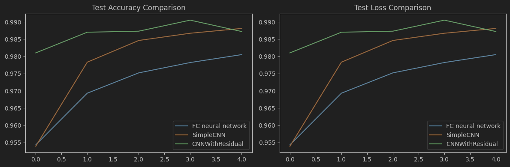
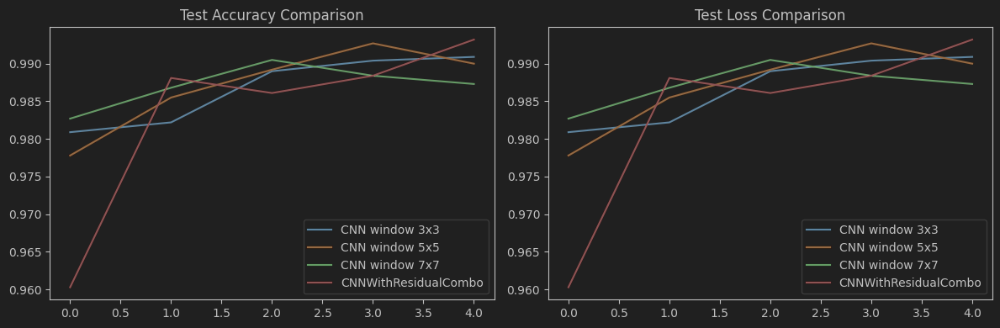
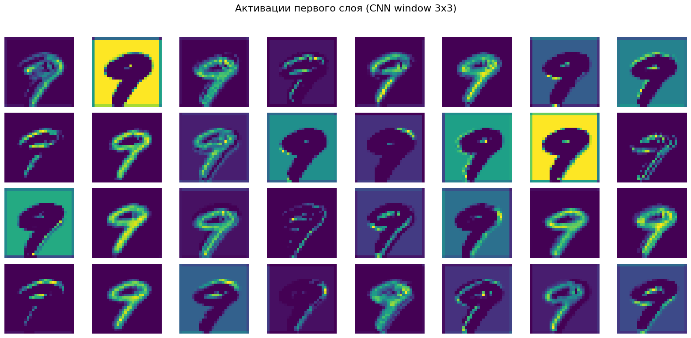
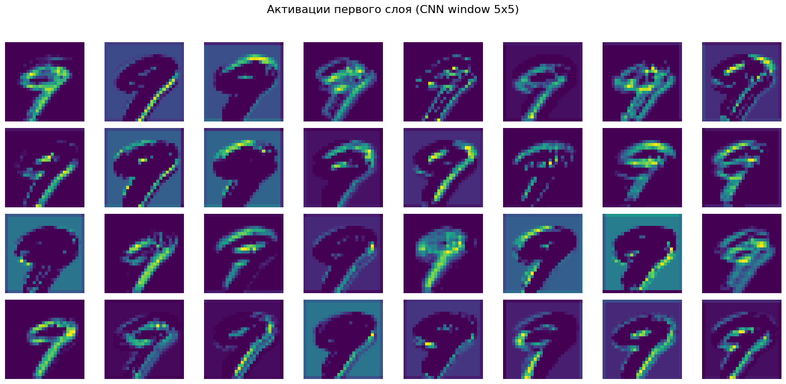
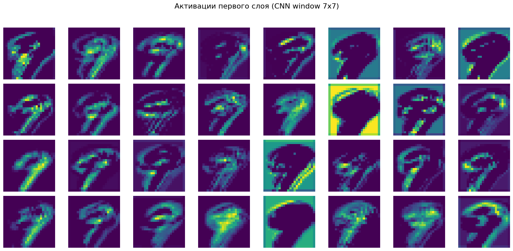
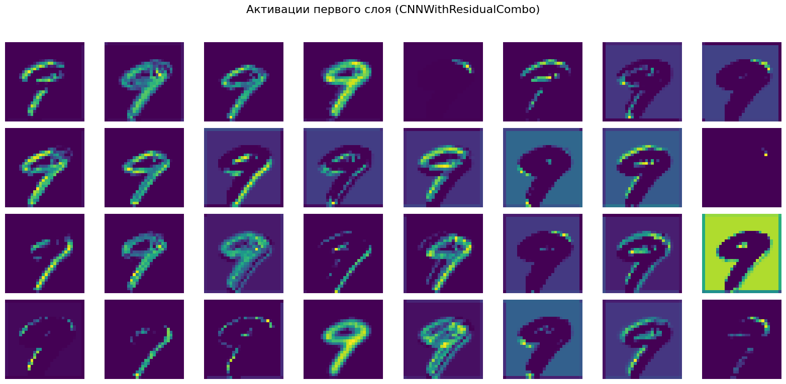
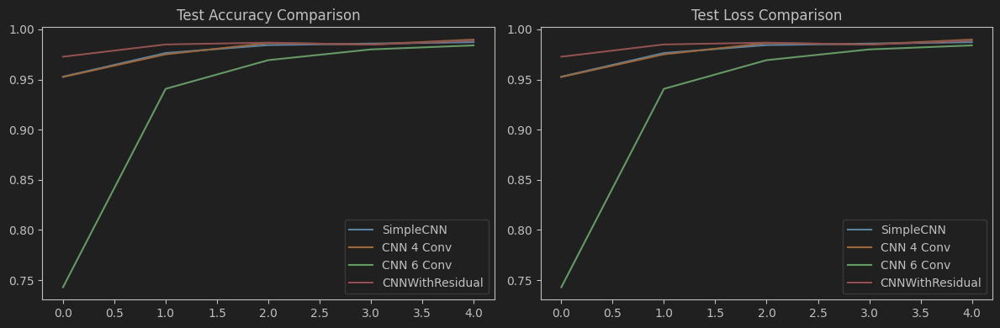
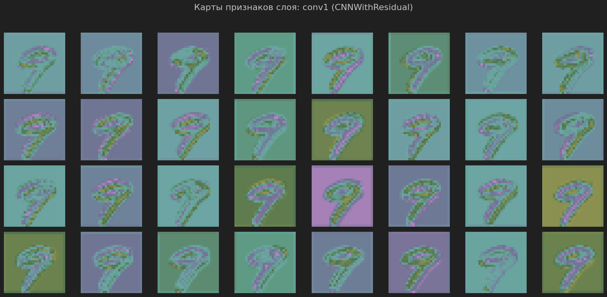

# Домашнее задание №4 Сверточные сети

## 1.1 - Сравнение моделей разной глубины
Как мы можем видеть по графикам тестирования, полносвязная нейросеть менее эффективна для данной задачи, нежели свёрточные.
Также свёрточная нейросеть с остаточными блоками обучается быстрее всего, путь и имеет риск переобучиться.

## 2.1 - Влияние размера ядра свертки
Лучшую точность показала нейронная сеть с комбинацией разных размеров ядра свёртки (1x1 + 3x3), она достаточно эффективно увеличивает глубину и нелинейность без сильного роста параметров.
Такое решение является оптимальным выбором между обобщением и локальностью

## 2.2 - Влияние глубины CNN
Вместе с увеличением глубины нейронной сети улучшалась и точность, но лишь до определённого предела. 
По итоговым результатам все модели показали примерно одинаковую эффективность. 
У модели с глубиной 6 наибольшая детализация признаков, однако модель с Residual Block более сбалансированная для обобщения.

