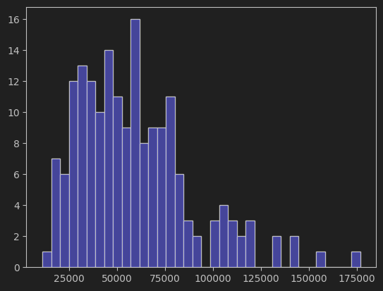
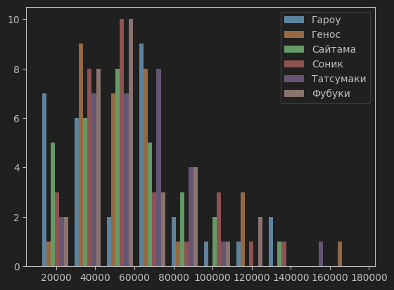
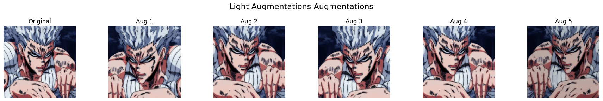
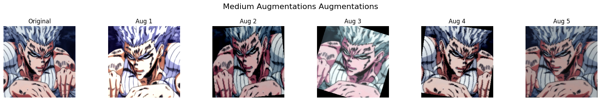
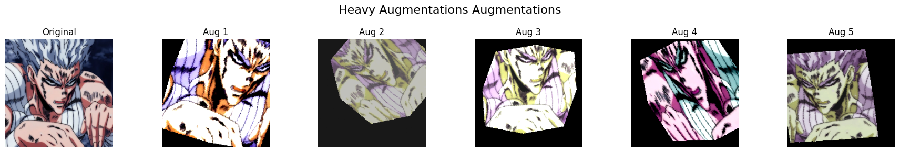
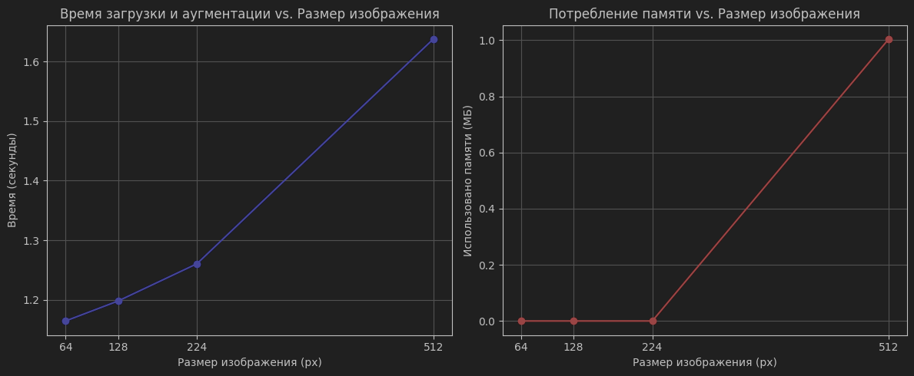
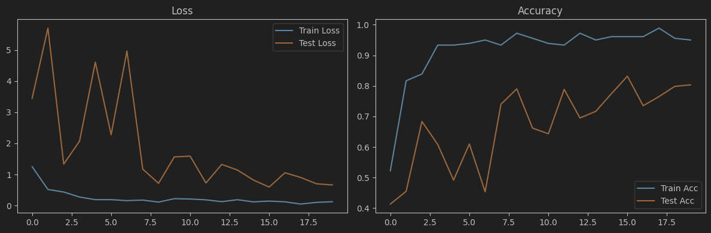

# Домашнее задание №5 - Аугментации и работа с изображениями

## 1 - Стандартные аугментации torchvision
Применим к изображениям из датасета стандартные аугментации.
Как можем заметить, аугментации немного изменяют начальное изображение, добавляя в него различные артефакты. 
Раздельное использование аугментаций помогает с дообучением модели. Однако применение всех стандартных аугментаций вместе делает изображение неузнаваемым, такой пример использовать для обучения нельзя.
Вместо применения всех аугментаций вместе целесообразно применить комбинацию некоторых из них.
(Все изображения до/после находятся в ноутбуке. Переносить их сюда нецелесообразно, их СЛИШКО много)

## 2 - Кастомные аугментации
Создадим свои аугментации со случайным размытием, яркостью и контрастностью.
Как мы можем видеть, фильтры применились и привнесли разнообразие в набор данных для обучения.
Визуально данные аугментации справляются со своей задачей так же хорошо, как и уже готовые.

## 3 - Анализ датасета
В каждом классе по 30 изображений. Минимальный размер файла - 11186. Максимальный размер файла - 176740. Средний размер файла - 58867.5.
Размеры файлов лежат в распределении Пуассона (нормальное распределение с отклонением влево).

## 4 - Pipeline аугментаций
Pipeline аугментаций реализован в классе AugmentationPipeline. 
После запуска трёх конфигураций, можно заметить существенные отличия в изображениях.

## 5 - Эксперимент с размерами
Проведём эксперимент с разными размерами изображений на 100 экземпляров.
На первом графике мы можем наблюдать рост времени загрузки изображений (что-то между линейной и квадратической скоростью)
На втором графике наблюдается следующее - у всех размеров, кроме 512х512, затраты памяти почти одинаковые. В какой-то момент происходит резкий рост потребления ОП.

## 6 - Дообучение предобученных моделей
Возьмём одну из предобученных моделей - Resnet18, и дообучим её на нашем датасете с аугментацией.
На графике потерь мы можем видеть, что за 20 поколений они значительно снизились, а точность наоборот, возросла.
